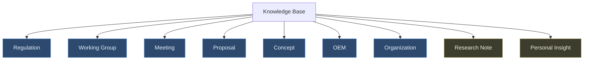
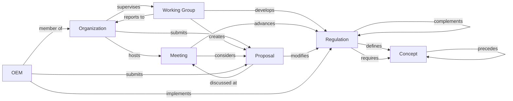
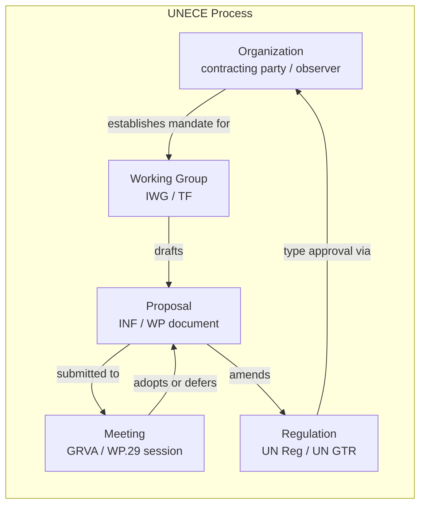
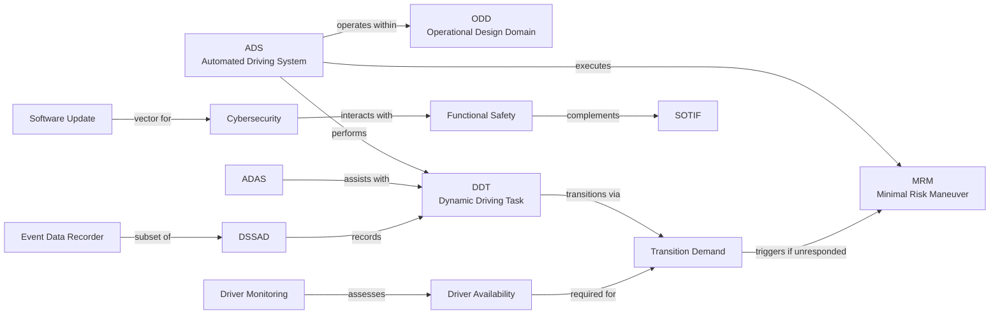
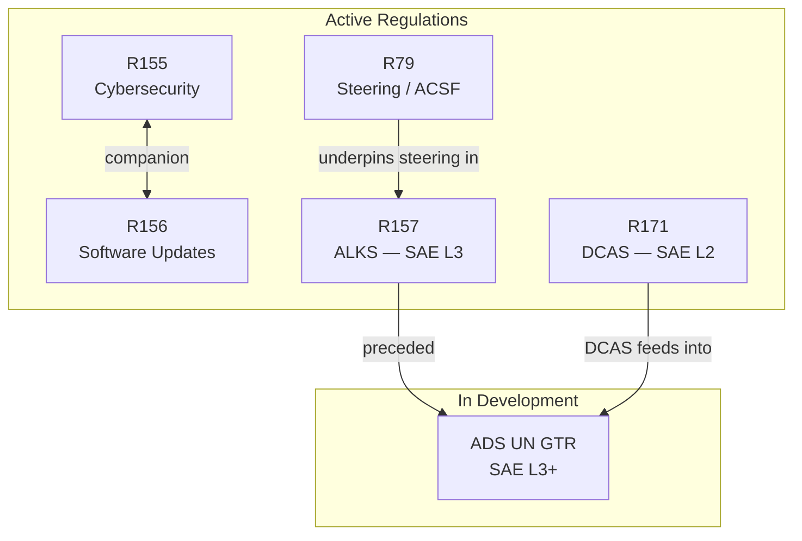
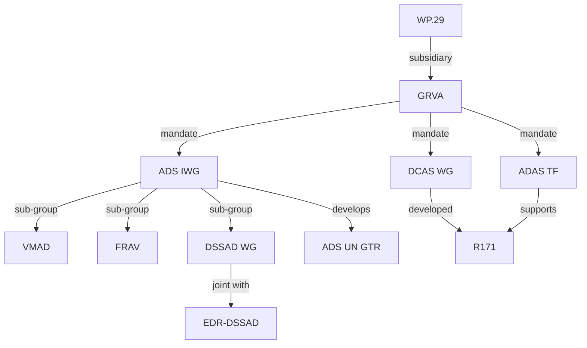
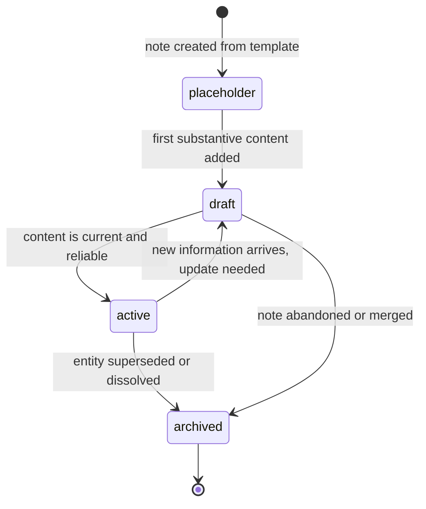

# ONTOLOGY — UNECE Automated Driving Knowledge OS

Concise visual model of the knowledge graph. Every future Claude session should load this file to understand the entity types and relationships in this vault before taking any action.

---

## Entity Hierarchy

---

## Core Entity Relationships

---

## Regulatory Process Flow

---

## Concept Dependency Graph (Core Concepts)

---

## Regulation Landscape

---

## Working Group Map

---

## Knowledge Lifecycle State Machine

---

## Entity Type Quick Reference

| Entity | Folder | Key Relationships | Status Values |
|---|---|---|---|
| `regulation` | `01 Regulations/` | defines Concept, developed by WG, implemented by OEM | placeholder → draft → active → archived |
| `working_group` | `04 Working Groups/` | creates Proposal, develops Regulation, reports to Org | placeholder → draft → active → dissolved |
| `meeting` | `02 WP29/` `03 GRVA/` `08 Meetings/` | considers Proposal, advances Regulation, hosted by Org | placeholder → draft → active → archived |
| `proposal` | `09 Proposals/` | modifies Regulation, submitted by Org, discussed at Meeting | placeholder → draft → active → adopted / rejected / deferred |
| `concept` | `05 Concepts/` | defined by Regulation, component of Concept | placeholder → draft → active → archived |
| `oem` | `06 OEM/` | implements Regulation, submits Proposal, member of Org | placeholder → draft → active → archived |
| `organization` | `07 Organizations/` | hosts Meeting, supervises WG, submits Proposal | placeholder → draft → active → archived |
| `research_note` | `10 Research Notes/` | analyzes Regulation, references Concept | draft → active → resolved → archived |
| `personal_insight` | `10 Research Notes/` | concerns Regulation, builds on Research Note | draft → active → archived |
